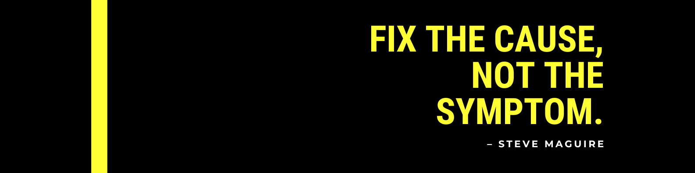

<!-- # Ahmed Maalawi -->

  <!-- Typing SVG by DenverCoder1 - https://github.com/DenverCoder1/readme-typing-svg -->
  

<!--  -->

<!-- ## Full-Stack Developer | Laravel & Vue.js Specialist -->

---

## 👨‍💻 Professional Summary

Experienced Full-Stack Developer with **2+ years of Laravel backend development** and **1+ year of Vue.js frontend expertise.** Passionate about building scalable web applications with clean architecture and optimal user experiences. Proven track record in developing robust APIs, implementing business logic, and creating responsive user interfaces.

**🎯 Currently seeking new opportunities** as a Full-Stack Developer to contribute to innovative projects and drive technical excellence.

---

## 🚀 Core Expertise

### Backend Development (2+ Years Experience)

- **Laravel Framework** - Advanced proficiency in MVC architecture, Eloquent ORM, and API development
- **PHP** - Strong foundation in object-oriented programming and modern PHP practices
- **RESTful APIs** - Design and implementation of secure, scalable API endpoints
- **Database Design** - MySQL optimization, migrations, and complex query operations
- **Authentication & Authorization** - JWT, OAuth, and role-based access control

### Frontend Development (1+ Year Experience)

- **Vue.js** - Component-based architecture, state management, and reactive programming
- **JavaScript/TypeScript** - ES6+, async programming, and modern development practices
- **Responsive Design** - Mobile-first approach with Tailwind CSS and modern UI frameworks
- **API Integration** - Seamless frontend-backend communication and data handling

---

## 🛠️ Technical Stack

### Languages & Frameworks

    

### Frontend Technologies

   

### Database & Tools

        

---

## 💼 What I Bring to Your Team

- **🎯 Problem Solving:** Strong analytical skills with ability to break down complex requirements
- **⚡ Performance Focus:** Optimization-minded approach to both frontend and backend development
- **🔧 Best Practices:** Clean code, SOLID principles, and comprehensive testing methodologies
<!-- - **📱 Modern Development:** Experience with containerization, CI/CD, and cloud deployment -->
- **🤝 Collaboration:** Excellent communication skills and experience working in agile environments

---

## 🌟 Currently Learning & Expanding

 

Continuously expanding my skill set with containerization, server management, and cloud infrastructure to become a more well-rounded developer.

## 📈 GitHub Analytics

  
  

  

|  |  |
| ------------- | ------------- |

    
    
   

---

## 🎓 Education & Background

**Bachelor of Computer Science**
*Modern Academy For Computer Science and Information Technology*

Comprehensive education in software engineering principles, data structures, algorithms, and modern web development practices.

---

## 📞 Let's Connect

I'm always interested in discussing new opportunities, collaborative projects, or sharing knowledge about full-stack development.

**📧 Email:** <ahmedelmaalawi@gmail.com>
**💼 LinkedIn:** [Ahmed Maalawi](https://www.linkedin.com/in/ahmed-maalawi/)
**📱 WhatsApp:** [+20 101 925 5748](https://wa.me/201019255748)
